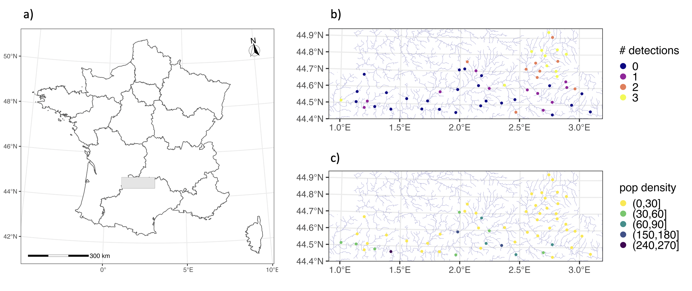

<!--# Insert author affiliations below -->

\small

^1^ CEFE, Univ Montpellier, CNRS, EPHE, IRD, Montpellier, France


`*` Corresponding author: olivier.gimenez@cefe.cnrs.fr

\normalsize


<!--# Write Abstract and Keywords below -->

\vspace{1cm}
\hrule

To monitor streams and rivers biodiversity, we need to quantify species distribution. To do so, occupancy models allow distinguishing the non-detection of a species from its actual absence. Occupancy models can account for spatial autocorrelation, but are not suited for streams and rivers because of their spatial structure in networks. Here I propose spatial occupancy models for data collected on stream and river networks. I present the statistical developments of the model, then I illustrate the approach on a semi-aquatic mammal. Overall, spatial stream network occupancy models provide a formal approach to assess biodiversity in streams and rivers.

\vspace{3mm}
\hrule
\vspace{5mm}

*Keywords*: Bayesian statistics, Spatial stream network models, Occupancy models, Spatial autocorrelation, Wildlife monitoring


\bleft
\newpage


```{r setup, include=FALSE, cache=FALSE, message = FALSE}

library("knitr")

### Chunk options: see http://yihui.name/knitr/options/ ###
## Text results
opts_chunk$set(echo = FALSE, warning = TRUE, message = TRUE)

## Code decoration
opts_chunk$set(tidy = TRUE, comment = NA, highlight = TRUE)

## Cache
# opts_chunk$set(cache = 2, cache.path = "output/cache/")

## Plots
opts_chunk$set(fig.path = "output/figures/")
```


```{r knitcitations, cache = FALSE}
library(knitcitations)
cleanbib()   
cite_options(citation_format = "pandoc")
```


<!--# Start writing your paper below -->


# INTRODUCTION

Streams and rivers provide essential habitats for numerous species of animals and plants, many of which are endemic [@D2006]. The ecological health of these freshwater ecosystems is paramount not only for the biodiversity they harbor but also for the ecosystem services they provide, which are indispensable to both wildlife and human populations [@V2022]. However, human activities are altering the natural conditions of streams, rivers and their associated riparian habitats, jeopardizing the persistence of these ecosystems [@A2020].

In that context, species distribution models (SDMs) are essential tools in understanding and preserving biodiversity [@Elith2009]. SDMs predict the distribution of species, helping scientists and conservationists identify critical habitats and biodiversity hotspots. SDMs also inform strategies aimed at mitigating impacts of climate and land-use changes, manage invasive species or enhancing habitat connectivity in freshwater ecosystems [@D2015].

SDMs are known to be affected by two main issues, namely imperfect detection and spatial autocorrelation [@GK2018]. First, a species present in a given area may go undetected during surveys due to various factors such as observer experience, species behavior, and environmental conditions. Ignoring *imperfect detection* can lead to biased estimates of species distribution, and flawed inference about the relationship between species presence and environmental factors [@Kery2008; @Lahoz2014], potentially misinforming conservation strategies and habitat management decisions. To address this issue, occupancy models are SDMs that rely on repeated visits of spatial sampling units for inferring distribution [@mackenzie2017]. These models have been widely used in freshwater ecosystems for various taxa [@Charbonnel2022; @Hamer2021; @Wedderburn2022; @Preece2021]. Second, SDMs rely on the assumption of independent residuals, which may be violated if sampling sites that are close together tend to have similar probabilities of species presence **pas très bien dit, et je ne parle jamais de pr d occupancy, y remédier?**. Ignoring *spatial autocorrelation* can lead to biased estimates of species distribution, and can inflate the probability of erroneously detecting the effect of environmental covariates [@Dormann2007]. Several extensions of occupancy models have been proposed to account for spatial autocorrelation, building on existing conditional autoregressive and geoadditive models in the spatial statistics litterature [@Rushing2019; @Broms2014; @Johnson2013]. However, these models rely on the Euclidean distance between the spatial sampling units, which does not acknowledge the spatial structure of streams and rivers in networks.

Here I propose spatial occupancy models that allow spatial autocorrelation structured according to stream flow and flow connectivity. I build on the linear mixed modelling approach proposed by [@VerHoef2010; @Peterson2010], which allows considering a mixture of distance-based spatial correlation structures (Euclidean or not) in a single model. I plug-in this variance component approach into occupancy models using a Bayesian approach. I present the statistical developments of the model, and I illustrate the approach on a semi-aquatic mammal in French streams and rivers. 


# METHODS

https://onlinelibrary.wiley.com/doi/full/10.1111/j.1365-2699.2011.02487.x

How is spatial autocorrelation accounted for in occupancy models? 

The usual way is to write the probability of occupancy on some scale, here the logit scale, as a function of covariates the X and some random effect epsilon to capture spatial variation. 

This epsilon is distributed as a multivariate normal distribution with a covariance matrix which we write as the product of a variance term sigma squared times a correlation matrix big R. 


Big R captures the correlation between each pair of sites, the lower-case r’s. 

These correlations are assumed to be a function of the distance between sites i and j, and a scale parameter theta. Here this function is the exponential.

The correlation will be 1 at distance 0 when i and j are the same site. The correlation will decline with increasing distance between two sites. 

In addition, the larger the scale parameter theta, 
the slower the decrease in correlation with distance.

The question now is which distance should we use. Let’s get back to being an otter travelling the river to find fish and shelter. If the flow goes from top to bottom. Then going from site 1 to 4 is tricky and the euclidean distance is irrelevant. So we prefer using stream distance instead, and go from site 1 to 4 by following the flow. We will call them flow-connected sites. Let’s forget about otters for a minute. Let’s assume we’re studying organisms that disperse passively with the flow, like mussels or some insects. 
We need to consider models that do not allow autocorrelation between sites if the water at one site does not flow into another.  Like here between sites 1 and 2. We will call them flow-unconnected sites. So two things are important: stream distance and flow connectivity. 

Jay Ver Hoef and Erin Peterson back in 2010 developed statistical models that allow accounting for stream distance and flow connectivity in linear models. 

These are called spatial stream network models. 

They add a random term with spatial covariance between flow-connected sites.

Then they add spatial covariance between flow connected and flow-unconnected sites.

This is for correlation between sites that can occur with active movements, with or against the river flow ; 

Last, they add correlation that can occurs independently of the network topology using the Euclidean distance. 

In which we structure the random effect like in spatial stream network models we’ve just seen. 

## Occupancy models

Any spatial or ecologically relevant variable can be used to construct the weights, as long as it is available for every segment in the stream network (Fig. 1). Simple options are to use equal weights or Shreve’s stream order (Shreve, 1967), but the watershed area (i.e. area of land that drains downhill to a common point on the stream network) is commonly used as a surrogate for water volume (Frieden et al., 2014). 

Tail-down models differ from tail-up models because they allow spatial correlation between both flow-connected and flow-unconnected locations.

Occupancy models rely on several assumptions. 
First, we assume closure which means we assume a site remains in the same state, occupied or non-occupied. 
Second we assume independence of the surveys and sites. 


## Case study


We used the statistical language `R` `r citep(citation())` for all our analyses. These were implemented in `SSN2` `r citep(citation("SSN2"))`, `tidyverse` `r citep(citation("tidyverse"))`, `sf` `r citep(citation("sf"))`, `rstan` `r citep(citation("rstan"))`, `bayesplot` `r citep(citation("bayesplot"))`, `geodata` `r citep(citation("geodata"))`, `ggspatial` `r citep(citation("ggspatial"))`, `rmapshaper` and `r citep(citation("rmapshaper"))` packages. 

The species went almost extinct in the 20th century, it was hunted for its fur. Thanks to the banning of hunting and its protection, it is now recolonizing our country. In that context, the question we’re asking is what is its current distribution. 

To answer this question, we collect scats the species leaves behind. 

Now to the case study. I investigated the effect of human disturbance on otter occupancy. 
The study site is in this rectangle here, between Montpellier where I live and Swansea. 
There were 56 sites that were visited 3 times. 
Clearly we have some spatial variation in the number of detections. 
I used human density as a proxy for human disturbance. 
Human density can lead to disturbance of otters through urbanization for example. 
We recorded human density as the number of inhabitants per km2 in a buffer around each stream. 


# RESULTS

Trees in forest *A* grew taller than those in forest *B* (mean height: `r mean(25, 31, 28)` versus `r mean(13, 19, 16)` m). 

And many more cool results that get updated dynamically, e.g. see Table \@ref(tab:Table-mtcars) and Fig. \@ref(fig:scatterplot). Note Tables and Figures are **cross-linked and numbered automatically**. They could also appear in the middle of the document, not necessarily at the end.

See also Fig. \@ref(fig:SupplFig) and Table \@ref(tab:SupplTable) in the Supplementary Material.


When spatial autocorrelation is ignored, we found a negative effect of human density on occupancy probability.

However, when we accounted for spatial autocorrelation using our new model, human density had no longer an effect on occupancy. 

The effect size of human density increases when spatial autocorrelation is ignored. 

The most likely explanation is that of a bias due to an omitted variable. 
Human density is spatially correlated, and its effect size is inflated. 
This bias is controlled when spatial autocorrelation is included.
There is probably a difference in occupancy according to another variable that would need to be accounted for.


# DISCUSSION

Si besoin, merge results and discussion sections. 

The focal ecological parameter of interest is the occupancy probability  $\psi$, which is represented similarly in all the five models compared. However, the precision of the occupancy estimation is impacted by the quality of the estimation for the detection process (kery2008, kellner2014). In this study, we focused on cases in which data is collected continuously, for example with sensors or opportunistic data. We aimed to evaluate whether modelling the detection process in continuous time could enhance the precision of the estimated probability of occupancy.

Ecologically, omitted bias variable. Check in Couturier which one it could be. Citer quand même le papier de Hodges sur spatial confusion. Citer aussi les échanges avec Jay VerHoef pour la difficulté in estimating le sill parameter. Mais ok pour covariate et prediction de l'occupancy. 

Application à eDNA. Alors besoin peut-être d'autres termes spatiaux comme tail-up, et euclidean. Ici on a utilisé que tail-down car on s'interesse aux otters. eDNA important pour monitor biodiv in freshwater and marine realms. If false positives wored out (voir work de E. Matechou), resste à proprement prendfre en compte spatial autocorrelation. 

Extension à dynamic occupancy models. Colonization function of distance to features that hamper movement of individuals. Citer les papier de Chandler, Morin et celui à paraître de Kervellec. L'idée est qu'on pourrait regarder la question de la connectivité dans river et stream network. Pas super compliqué, le papier du portuguais a paved the road.

Extending to dynamic occupancy to write the probability of colonization as a function of distance to landscape features that might hamper movements, and therefore assessing connectivity.


# Ethics and Integrity statements

## Data availability statement

Data and code are available at \href{https://github.com/oliviergimenez?tab=repositories}{https://github.com/oliviergimenez?tab=repositories}.

## Funding statement

This research is a product of the DISCAR group funded by the French Foundation for Research on Biodiversity (FRB) through its synthesis center CESAB.

## Conflict of interest disclosure

The author has no conflicts of interest to declare.


# REFERENCES

```{r write_citations, cache=FALSE, include=FALSE}
write.bibtex(file = "knitcitations.bib")
```

::: {#refs}
:::

\eleft

\clearpage

\newpage

\blandscape

```{r Fig-landscape, out.width="98%", fig.align='center', fig.pos='b', fig.cap="Second figure in landscape format."}

```

\elandscape
